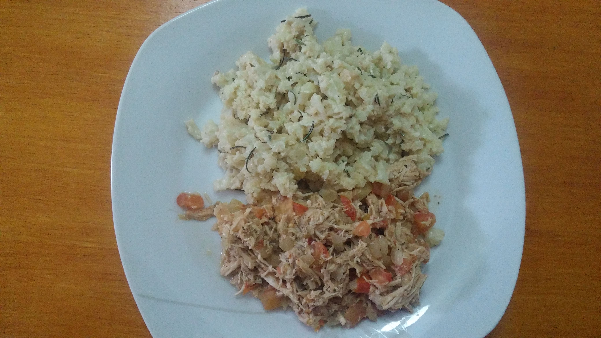

# Arroz de Couve-flor

## Ingredientes

* 400 couve-flor mediamente triturada no processador
* Sal a gosto
* 30 gramas de gorgonzola
* 100 gramas de creme de leite
* 1 cs de manteiga
* Azeite a gosto

## Modo de Fazer

1. Cozinhe levemente a couve-flor (pode ser à vapor ou normalmente)
2. Em uma panela em fogo baixo derreta a manteiga e adicione a couve-flor
3. Vá misturando devagar, até que esteja homogêneo.
4. Adicione o creme de leite e o gorgonzola e vá misturando até que fique homogêneo
5. Ao servir, adicione o sal e o azeite ao seu gosto

## Variação da receita

1. Siga os passos 1 e 2
2. Vá adicionando azeite aos poucos e mexendo
3. Adicione especiarias ao seu gosto

## Observações

1. Para quem gosta, com um tempero de alho e alecrim fica muito bom.
