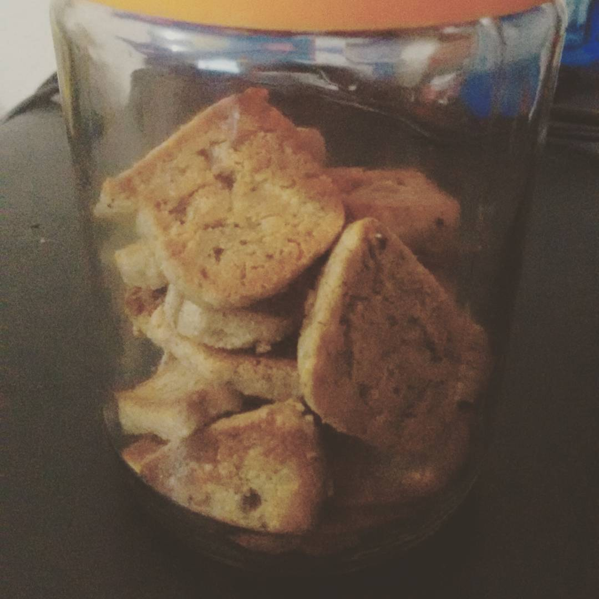

# Biscoitos amanteigados

## Ingredientes

(obs.: as medidas abaixo foram feitas usando um medidor de mℓ. Apenas coloque os ingredientes até chegar à medida indicada. Não fiz as conversões. :)
* 500mℓ de farinha de castanha de caju
* 125mℓ de farinha de coco (fiz com coco ralado e triturado no liqüidificador)
* +-10 pcts individuais (800mg) de adoçante (usei sucralose)
* 1cs de essência de baunilha
* 250mℓ de manteiga em temperatura ambiente
* 113g de cream cheees
* 1 ovo

## Modo de Fazer

1. Misture a manteiga e o cream cheese até virar uma massa homogênea.
2. Junte o ovo, o adoçante e a essência de baunilha e misture mais, até "sumir" o cheiro de ovo.
3. Acrescente as farinhas e misture bem.
4. Quando estiver homogêneo, deixe a massa descansar na geladeira por 4 horas ou no freezer por 1 hora. Vai ficar bem firme, mas ainda maleável pra moldar.
  * **Sugestão:** partir a massa em 3 e, caso for assar tudo de uma vez, trabalhe com uma parte enquanto as outras ficam na geladeira.
  * **Explicação:** a massa "descongela" rápido na temperatura ambiente... Se for modelar com as mãos, descongela mais rápido ainda... 
5. Enrole a massa inteira (use um saco pra ajudar a modelar) e corte em 3 partes. 
6. Corte os biscoitos individualmente, da forma como preferir (geralmente só parto o rolo em fatias finas (+- 0.5cm), mas vc pode esticar a massa com rolo de macarrão e usar um cortador, caso prefira um biscoito bonitinho)
7. Leve ao forno pré aquecido para assar em fogo baixo (180°). 
  * Se quiser biscoitos macios por dentro e mais crocantes nas bordas: +- 25 minutos
  * Se quiser biscoitos crocantes: +- 35min
  * Se quiser biscoitos SUPER crocantes, mas um pouco tostados: 40min
  
## Observações
  
* Eu prefero super crocante, mas dá pra ficar olhando enquanto assa até dar o ponto que você preferir. 
* É um dos biscoitos mais fáceis e gostosos que já vi! 
* A massa congelada pode ficar em congelador por muito tempo (já deixei por 2 meses!)
  
## Referência

* Pinterest (_risos_)
