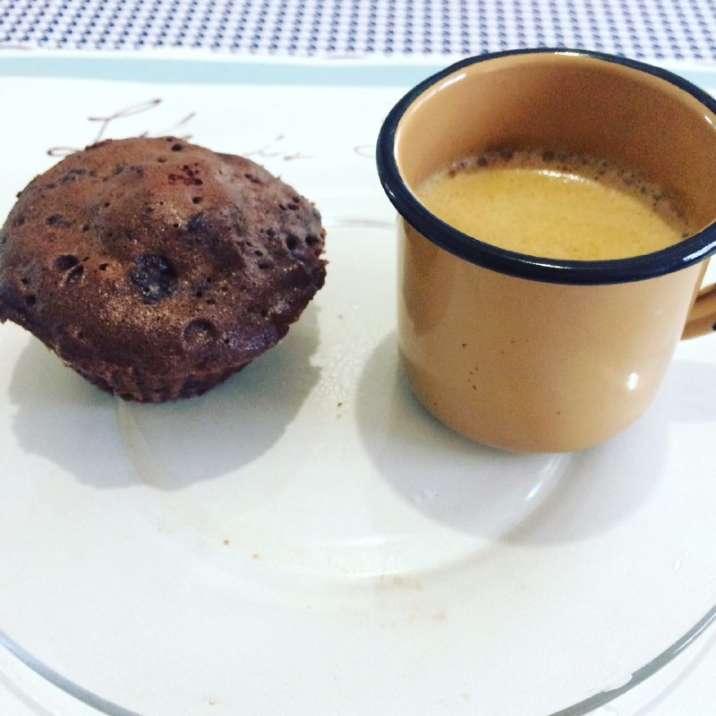

# Bolinho Base da Michelly
(sem glúten, sem lactose e sem açúcar)

## Ingredientes

* 1 ovo
* 1 colher de sopa de farinha de amêndoas (só processar as castanhas até virar uma farinha)
* 1 colher de chá de fermento
* 1 colher de sopa de cacau em pó 100% cacau
* 1 colher de sopa de adoçante (usei o xilitol)
* 1 colher de sopa de coco ralado
* 1 colher de sopa de ghee derretida ou óleo de coco
* Essência de baunilha a gosto

## Variação de ingredientes

* 2 ovos pequenos
* 2 colheres de sopa farinha de amêndoas 
* 2 colheres de sopa de cacau 100%
* 1 scoop de whey de chocolate(uso da Optimum Nutrition)
* 2 colheres de  sopa xilitol
* 1 colher de sopa bem cheia de manteiga ghee ou 2 rasas
* não coloquei coco e nem baunilha
* não coloquei fermento

## Modo de Fazer

1. Misture todos os ingredientes
2. Coloque em forminhas de cupcake
3. Para assar:
  3. Leve ao forno microondas por 1 minuto (ver a potência do micro, pode ser mais ou menos tempo dependendo da potência. O ponto correto é bem macio, parecendo bolo comum mesmo.)
  3. Leve ao forno comum por 200ºC por 10 minutos.

## Observações

* Da pra fazer com cenoura ao invés de chocolate e whey. É só colocar cenoura batida no liquidificador. Fica igual bolo de cenoura, muito bom.
* Também dá pra fazer com maracujá ou outro ingrediente. A receita é apenas a base.
