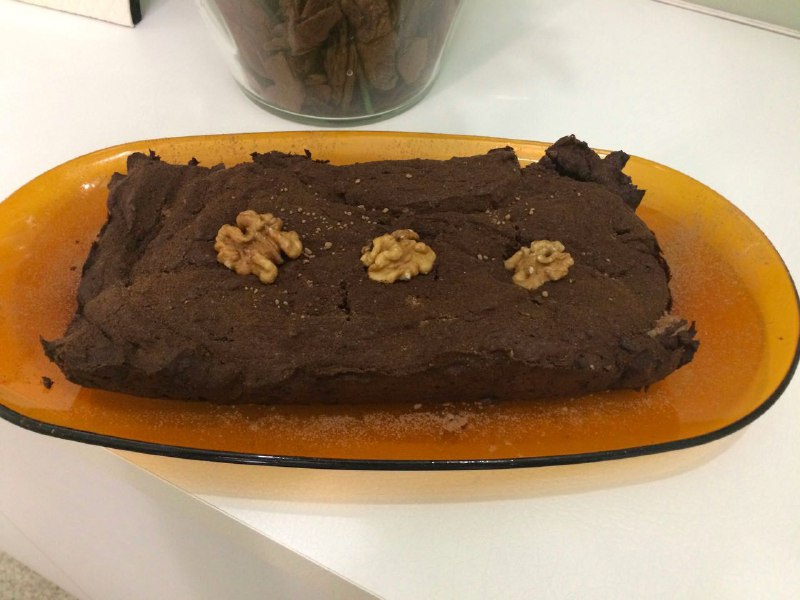

# Bolo/Brownie de Farinha de avelã e chocolate 70%

## Ingredientes

* 200g de chocolate 70% cacau, picado pequeno
* 120g de manteiga sem sal amolecida
* 130g de adoçante (pode ser eritritol, xylitol ou qualquer outro de sua preferência. Atenção para as quantidades! O adoçante é opcional)
* 100g de farinha de avelã passada no processador para ficar bem fininha (pode ser outra oleaginosa)
* 5 gemas
* 5 claras em neve (bata uma pitada de sal junto)
* 1 1/2 colher de chá de extrato de baunilha (ajuste de acordo com sua preferência)
* 1 colher de café de café solúvel (opcional, mas da um sabor de fundo excepcional)
* Noz moscada inteira (opcional)
* Para bolo, 1 colher de sopa de fermento

## Modo de Fazer

1. Derreta, em banho maria, o chocolate com a manteiga (Deve ser em fogo baixo e a tigela onde estiver o chocolate e a manteiga não deve encostar na água quente!)
2. Deixe esfriando e, enquanto isso, ligue o forno em 180ºC e deixe aquecendo. 
3. Em uma forma redonda (usei a de aro 20 e de fundo removível), forre o fundo com um círculo de papel manteiga untado e polvilhado com cacau em pó.
4. No chocolate derretido acrescente o adoçante, a farinha de avelã e misture até a massa ficar homogenea! 
5. Acrescente as gemas devagar na massa da tigela. Misture bem
6. Coloque o extrato de baunilha
7. Coloque uma colherinha de café solúvel e rale umas três pitadinhas de noz moscada
8. Misture bem.
9. Acrescente as claras em neve bem devagar na massa do chocolate. Tem que ser com cuidado para não deixar escapar o ar 'preso' nas claras. ele que dará leveza para o bolo.
10. Daqui pra frente:
  * Bolo: 
    * Acrescente o fermento e misture bem.
    * Coloque na forma e leve ao forno por, em média, 30/40 minutos.
    * Verifique se o bolo formou uma 'casquinha"e faça o teste de espetar uma faca, se sair limpa está pronto.
  * Brownie: 
    * Coloque na forma sem acrescentar mais nada. 
    * Leve ao forno por 20/30 minutos
    * Quando der a casquinha em cima, tá pronto!
