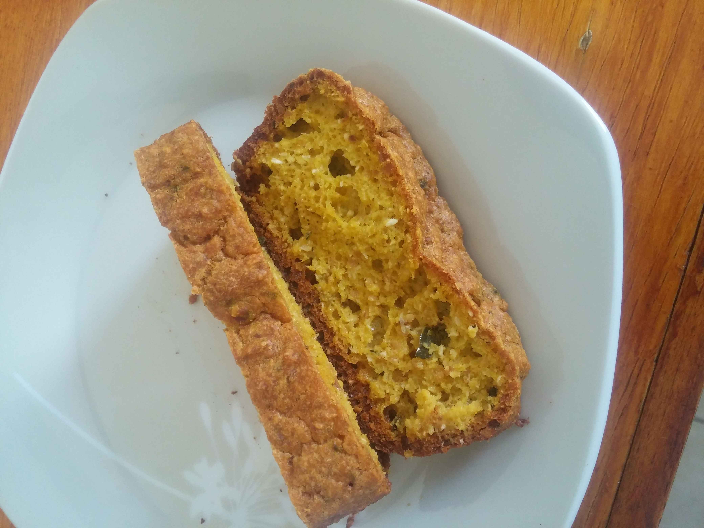

# Bolo de Abóbora

## Ingredientes

* 200 g de abóbora cozida e amassada
* 3 ovos
* 100g de fécula de mandioca
* 80g de coco ralado fino
* 1 colher de sopa de manteiga
* 50 ml de leite de coco
* 1 colher de café de fermento em pó
* 2 colheres de sopa bem cheias de amendoim moído
* Canela a gosto
* 3 gotas de essência de baunilha ou panetone

## Modo de Fazer

1. Misture todos os ingredientes, sendo o fermento por último até ficar homogêneo
2. Pré aqueça o forno a 240°C
3. Coloque a mistura em uma forma de pão e leve ao forno
4. Deixe 30 minutos a 240°C e depois 30 minutos a 200°C

## Observações

* Pode colocar outras especiarias e sementes até nozes!
## Referência

* http://www.paleorunningmomma.com/paleo-pumpkin-bread/
