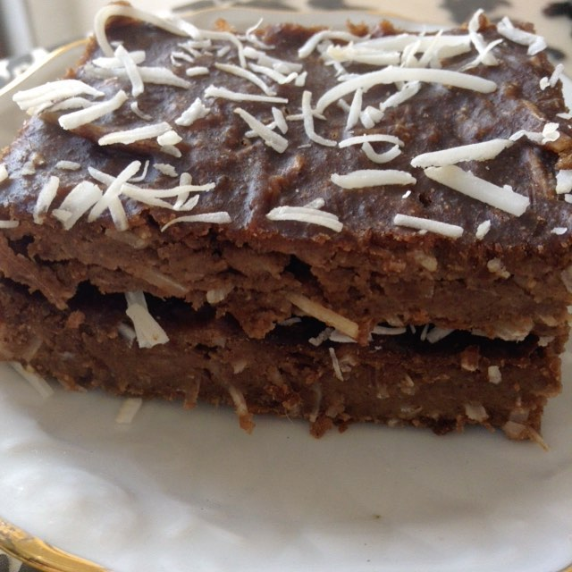

# Brownie de Banana

## Ingredientes

* 2 bananas médias
* 2 colheres de sopa bem cheias de pasta de amendoim
* Cacau em pó à gosto

## Modo de Fazer

1. Amasse as bananas
1. Adicione a pasta de amendoim e misture bem
1. Coloque em uma forma untada com óleo de coco
1. Asse em forno baixo (180°C por 20 minutos)

## Observações

* Pode colocar outras especiarias, como canela em pó, 5 peppers e até nozes!
* Com coco fica muito bom também!

## Referência

* Pinterest (_risos_)
