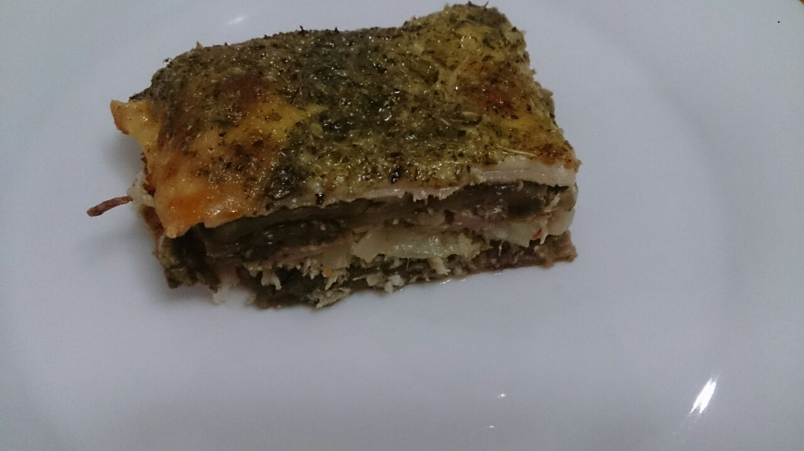

# Lasanha de Berinjela

## Ingredientes

* 3 berinjelas grandes
* 300 g de queijo mussarela fatiado
* 300 g de presunto fatiado
* 2 colheres de azeite
* 500g de molho bolonhesa
* Sal
* Orégano

## Modo de Fazer

1. Corte as berinjelas em fatias finas, no sentido do comprimento
2. Em um prato, vá colocando as berinjelas com um pouco de sal e azeite, uma sobre a outra até fazer um monte;
3. Leve ao microondas por 5 minutos;
4. Em um refratário/assadeira, forre fatias de presunto, de forma a tapar todo o fundo do refratário;
5. Coloque uma camada de berinjela;
6. Coloque o molho bolonhesa;
7. Coloque uma camada de queijo e presunto;
8. Coloque mais uma camada de berinjela e por cima coloque uma camada de queijo mussarela;
9. Repita os passos 6, 7 e 8, para formar mais camadas (opcional), deixando o queijo como camada superior;
10. Coloque orégano, cubra com papel alumínio e leve ao forno a 200ºc por 30 minutos;
11. Retire o papel alumúnio e deixe por mais 5 minutos.
12. Ao servir, se preferir, coloque uma colher de sopa rasa de cream cheese

