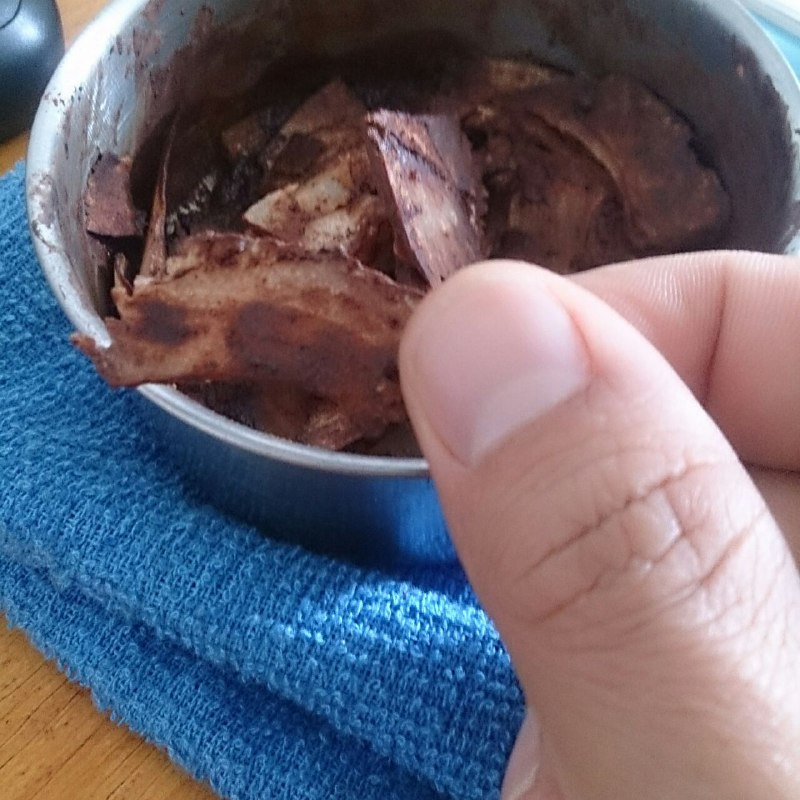

# Lascas de coco com cacau

## Ingredientes

* Lascas de coco seco
* 10 ml de leite ou leite de coco
* 1 colher de sopa de cacau em pó
* Adoçante a gosto
* Canela em pó

## Modo de Fazer

1. Misture todos os ingredientes de forma que o coco fique úmido 
e coberto com o cacau e canela

2. Coloque na Airfryer por 15 minutos
