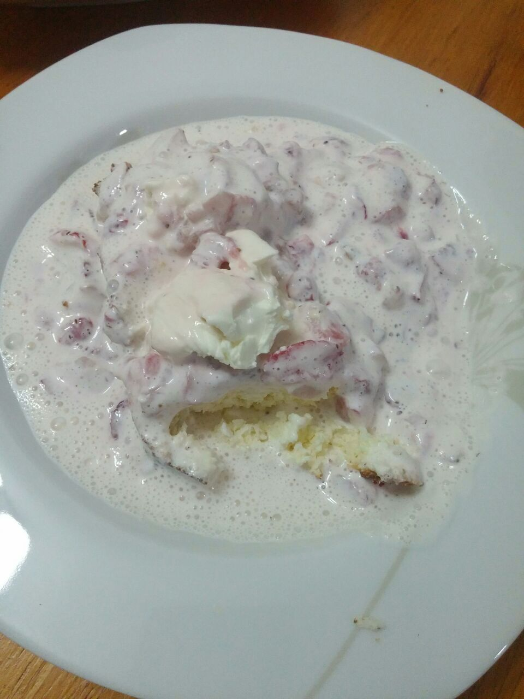

# Morango com Creme de Leite

## Ingredientes

* 1 caixa de morango picado
* 1 caixa de creme de leite
* Adoçante a gosto

## Modo de Fazer

1. Coloque o morango picado em uma tigela que consiga misturar
2. Coloque o creme de leite e o adoçante
3. Vá misturando devagar, até que o creme esteja rosa
4. Coloque para gelar por alguns minutos
5. Ao servir, se preferir, coloque uma colher de sopa rasa de cream cheese

## Variação da receita

1. Prepare a queijadinha versão bolo genérico
2. Coloque o creme de morango por cima ao servir

# Observações

1. Serve muito bem para se fazer uma batida com Vodka ou Gin.
