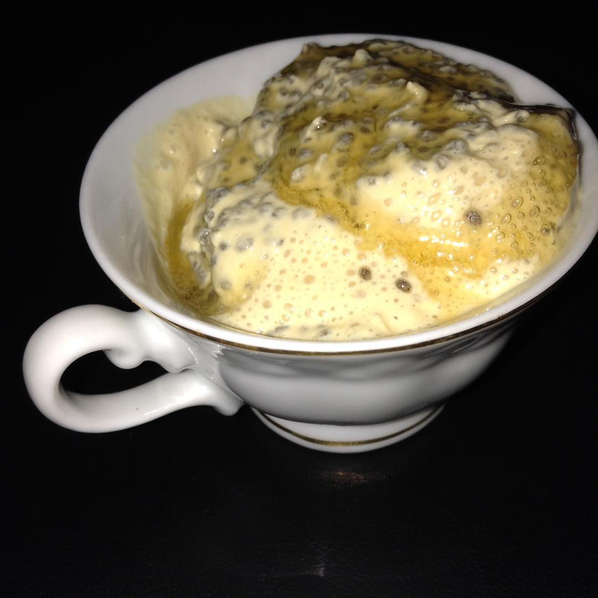

# Mousse de pêssego com chia

## Ingredientes

* 1 lata de creme de leite
* 2 pacotinhos de polpa de pêssego (100g cada)
* 1/2 xícara de sementes de chia

## Modo de Fazer

1. Bata o creme de leite e a polpa no liquidificador. Quanto mais bater, mais aerado fica.
1. Coloque a chia e misture levemente
1. Leve à geladeira por mais ou menos 4 horas.

## Observações

* Fica parecendo que tem gelatina! 
* E pode fazer com qualquer polpa!
* Pode adoçar se quiser
* Pode diminuir a chia, eu gosto da crocância que ela dá (nunca tentei fazer sem)
