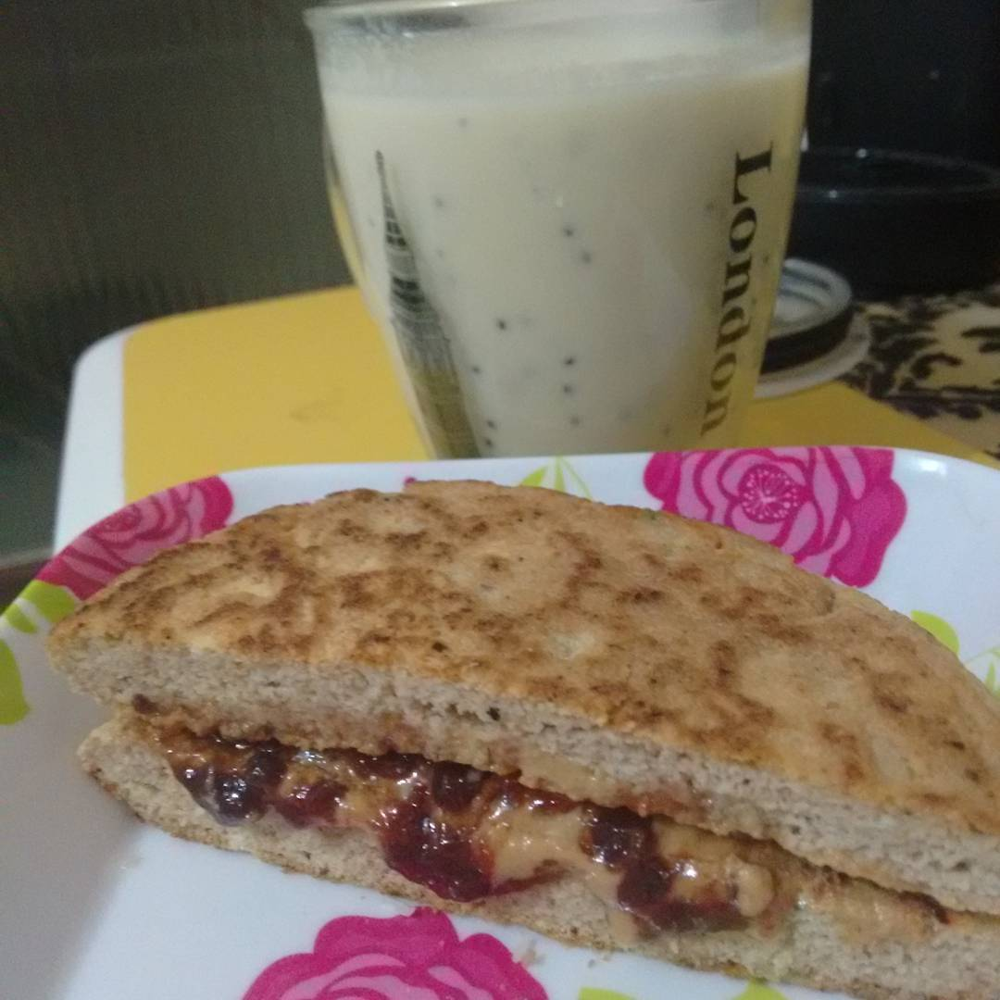

# Panini Low Carb

## Ingredientes

* 1 ovo
* 3 colheres de farinha de coco
* 2 colheres de água
* Essência (de coco, baunilha, amêndoa) à gosto

## Modo de Fazer

1. Bata bem o ovo para não ficar com cheiro
2. Misture os outros ingredientes até ficar homogêneo
3. Unte uma frigideira pequena com óleo de coco
4. Coloque a mistura na frigideira e leve ao fogo bem baixo
5. Tampe a frigideira
6. Depois de "cozido", vire para dourar do outro lado

## Observações

* Na foto, fiz com essência de coco, parti ao meio e recheei com geléia 100% fruta e pasta de amendoim
* Caso faça sem essência, pode rechear com ingredientes salgados também
