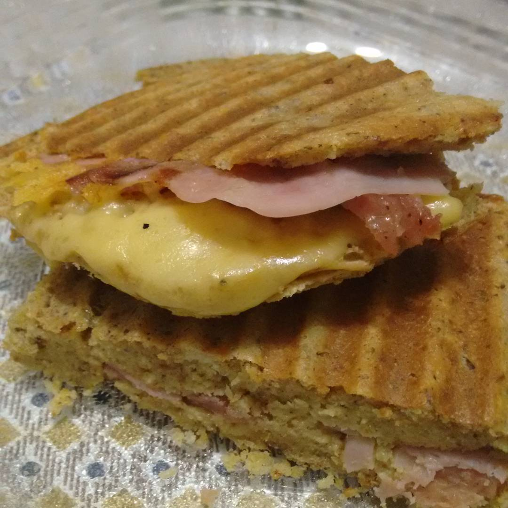

# Pão Low Carb (variação do dr. Souto)

## Ingredientes

* _6 colheres de sopa_ de _farinha de castanha de caju_
* _2 colheres de sopa_ de _amendoim torrado e moído_
* _1 colher de sopa_ de _cream cheese_
* _1 colher de sopa_ de _manteiga_
* _2 ovos_
* _1 pitada_ de _fermento_
* _1 pitada_ de _sal_

## Modo de Fazer

1. Misture os ingredientes secos (exceto o fermento);
2. Bata bem os ovos com um garfo, para que não fique com cheiro de ovo;
3. Coloque em uma vasilha (preferencialmente de vidro ou silicone);
4. Leve ao microondas por 3 minutos

## Opcional

1. Desenforme o pão
2. Parta-o no formato que desejar
3. Recheie
4. Leve à misteira (ou grill) até dourar, como se fosse um misto quente

## Observações

A receita rende bem, dois sanduíches iguais aos da foto.

## Experiências e variações

* Dá pra fazer com farinha de coco e de linhaça, dá pra fazer sem amendoim (aí acrescenta mais a mesma quantidade da farinha utilizada), dá pra usar requeijão (1 colher de sopa bem cheia) ao invés de cream cheese e manteiga, mas a receita acima foi a melhor versão que já cheguei. 
* Não tem gosto residual (tipo o que fica com linhaça), a textura é mais fofinha...
* Ja fiz duas receitas, coloquei em forma de silicone para pão e levei ao microondas por +- 10 minutos (coloquei 6 minutos inicialmente e aumentei aos poucos). Rendeu um pão do tamanho de um pão de forma. Durou mais de uma semana na geladeira.

## Referência

* [Receita Original](http://www.lowcarb-paleo.com.br/2015/09/o-pao-low-carb-mais-facil-do-mundo.html)
