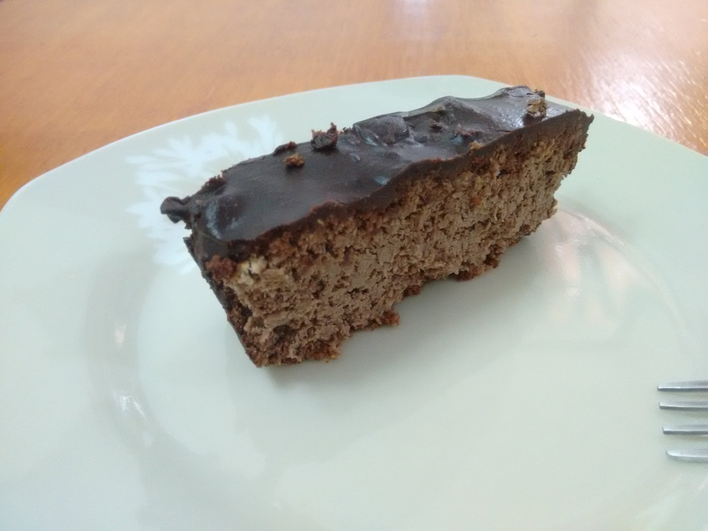

# Queijadinha - Versão Bolo Genérico

## Ingredientes

* 100g de coco ralado fino (sem estar adoçada) - Ou conhecido como farinha de coco
* 100ml de leite de coco
* 50 gramas de parmesão ou provolone ou outro queijo ralado de sua preferência
* 1 cx de creme de leite
* 1 cs de manteiga
* 2 ovos
* 1 colher de café de fermento
* 3 gotas de essência de baunilha ou outra de sua preferência

## Modo de Fazer

1. Hidrate a farinha de coco com o leite de coco misture e deixe descansar por alguns minutos
2. Bata as claras em neve
3. Em um recipiente, misture ao coco hidratado: o creme de leite, a manteiga, o queijo e as gemas dos ovos. Vá misturando devagar, até que esteja homogêneo.
4. Adicione as claras em neve, a essência e o fermento e misture mais um pouco.
5. Em uma forma de pão já untada, coloque a mistura e leve ao forno médio até que a parte de cima esteja dourada (aprox. 40 min).

## Variação da receita

1. Siga todos os passos, retirando da receita o queijo. Ficará um bolo genérico.

## Variação com cobertura

1. No lugar do queijo, coloque cacau em pó, ficará um bolo de chocolate
2. Faça uma cobertura de chocolate com cacau em pó ou chocolate 70% e jogue por cima enquanto o bolo estiver ainda quente.

## Observações

1. Para quem gosta, com um tempero de alho e alecrim fica muito bom.
